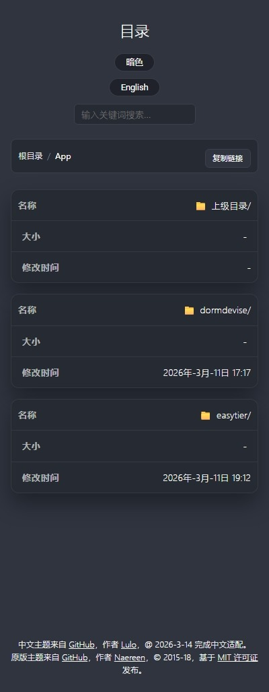
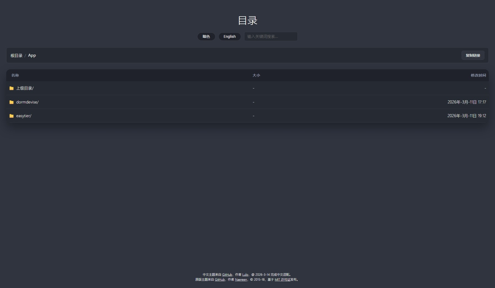
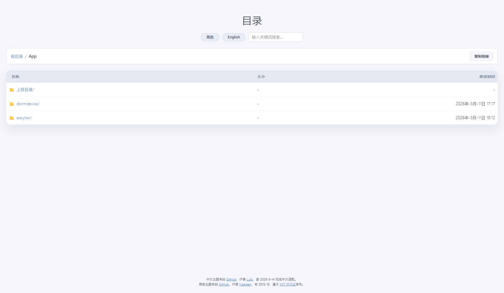

# Nginx-Fancyindex-Theme

[中文](README.md)  |  [English](README_en.md)

为 [Nginx](https://www.nginx.org/) 的 [Fancyindex 模块](https://github.com/aperezdc/ngx-fancyindex) 提供的响应式主题（作者 @aperezdc）。

基于 [Nginx-Fancyindex-Theme](https://github.com/Naereen/Nginx-Fancyindex-Theme) 提供的主题（作者 @Naereen）进行中文适配。

- [Nginx-Fancyindex-Theme](#nginx-fancyindex-theme)
  - [使用方法](#使用方法)
    - [FancyIndex 安装来源](#fancyindex-安装来源)
    - [Nginx 配置](#nginx-配置)
    - [RHEL 操作步骤](#rhel-操作步骤)
  - [配置选项](#配置选项)
  - [语言切换](#语言切换)
  - [JavaScript 说明](#javascript-说明)
  - [截图](#截图)

## 使用方法

1. 确保 fancyindex 包已构建或已安装
2. 在 nginx 配置中启用 fancyindex 相关指令
3. 将 `Nginx-Fancyindex/` 目录放到你在 nginx 配置中通过 `alias` 指向的位置（或站点根目录）
4. 重启或重载 nginx

### FancyIndex 安装来源

- EPEL 9 的 RPM: <https://rhel.pkgs.org/9/epel-x86_64/nginx-mod-fancyindex-0.5.2-3.el9.x86_64.rpm.html>
- 从源码构建: <https://github.com/aperezdc/ngx-fancyindex?tab=readme-ov-file#building>

### Nginx 配置

```conf
...
http {
    ...
 
    # 根据 cookie 'lang' 的值设置主题目录别名（默认中文）
    map $cookie_lang $theme_alias {
        default /download-nginx/decorate/Nginx-Fancyindex-Theme/Nginx-Fancyindex-zhCN;
        ~*^(zh|zh-cn|cn)$ /download-nginx/decorate/Nginx-Fancyindex-Theme/Nginx-Fancyindex-zhCN;
        ~*^(en|en-us|us)$ /download-nginx/decorate/Nginx-Fancyindex-Theme/Nginx-Fancyindex;
    }

    server {
        listen       80;
        server_name  localhost;

        # 性能优化：静态下载与目录列表
        sendfile on;
        tcp_nopush on;
        tcp_nodelay on;
        keepalive_timeout 65;
        keepalive_requests 1000;

        # 文件句柄缓存，减少磁盘 stat 开销
        open_file_cache max=10000 inactive=30s;
        open_file_cache_valid 60s;
        open_file_cache_min_uses 2;
        open_file_cache_errors on;

        # Gzip 用于 HTML/CSS/JS 等文本资源
        gzip on;
        gzip_comp_level 5;
        gzip_min_length 1024;
        gzip_vary on;
        gzip_proxied any;
        gzip_types
            text/plain
            text/css
            text/javascript
            application/javascript
            application/json
            application/xml
            text/xml
            image/svg+xml
            application/rss+xml;

        location / {
            root   /file/download;
            fancyindex on;
            fancyindex_exact_size off;
            fancyindex_localtime on;
            fancyindex_header "/.theme/header.html";
            fancyindex_footer "/.theme/footer.html";
            fancyindex_ignore ".theme";
            # 其他 fancyindex 配置项...
        }

        # 主题文件别名，根据 cookie 动态切换
        location /.theme {
            alias $theme_alias;
            expires 30d;
            add_header Cache-Control "public, max-age=2592000, immutable";
            add_header Vary "Accept-Encoding, Cookie";
        }
    }
}

```

### Docker 安装步骤

#### Dockerfile 示例

```dockerfile
FROM nginx:alpine AS builder

# 安装编译工具
RUN apk add --no-cache \
    gcc \
    make \
    libc-dev \
    linux-headers \
    pcre-dev \
    zlib-dev \
    openssl-dev

# 复制本地已下载的 fancyindex 源码
COPY decorate/ngx-fancyindex-0.6.0 /tmp/ngx-fancyindex

# 获取 Nginx 版本并下载对应源码（使用 awk 提取版本号）
RUN NGINX_VERSION=$(nginx -v 2>&1 | awk -F '/' '{print $2}' | awk '{print $1}') && \
    wget -qO- http://nginx.org/download/nginx-${NGINX_VERSION}.tar.gz | tar xz -C /tmp

# 编译动态模块
RUN cd /tmp/nginx-* && \
    ./configure --with-compat --add-dynamic-module=/tmp/ngx-fancyindex && \
    make modules && \
    cp objs/ngx_http_fancyindex_module.so /tmp/

# 第二阶段：最终镜像
FROM nginx:alpine
COPY --from=builder /tmp/ngx_http_fancyindex_module.so /usr/lib/nginx/modules/
```

#### Docker Compose 配置示例

```yaml
services:
  download-nginx:
    build: .                       # 使用当前目录下的 Dockerfile 构建
    image: nginx-fancyindex:local  # 为构建出的镜像命名
    container_name: download-nginx
    restart: always
    ports:
      - "80:80"
    volumes:
      - /download-nginx/conf/nginx.conf:/etc/nginx/nginx.conf
      - /download-nginx/conf.d:/etc/nginx/conf.d
      - /download-nginx/html:/usr/share/nginx/html
      - /download-nginx/logs:/var/log/nginx
      # 美化文件目录
      - /download-nginx/decorate:/download-nginx/decorate
    environment:
      - TZ=Asia/Shanghai
```
#### 运行容器

```bash
# 在 Docker 环境中，构建并运行容器
docker-compose build
docker-compose up -d
```

## 配置选项

标准配置示例如下：

```bash
fancyindex on;
fancyindex_localtime on;
fancyindex_exact_size off;
fancyindex_header "/.theme/header.html";
fancyindex_footer "/.theme/footer.html";
# 被忽略的文件不会出现在目录列表中，但仍可访问
fancyindex_ignore "examplefile.html";
# 确保这些文件夹不显示在列表中
fancyindex_ignore "Nginx-Fancyindex";
```

## 语言切换

- 默认中文（未设置 `lang` cookie 时）
- `lang=zh` 使用中文主题，`lang=en` 使用英文主题
- 页面内置的语言切换按钮会写入 cookie 并刷新页面

## JavaScript 说明

- `addNginxFancyIndexForm.js` 为目录页增加搜索过滤、主题切换、分页等功能。
- `showdown.min.js` 提供 Markdown 转 HTML 的能力，用于加载可选的文档文件。

## 截图








---
